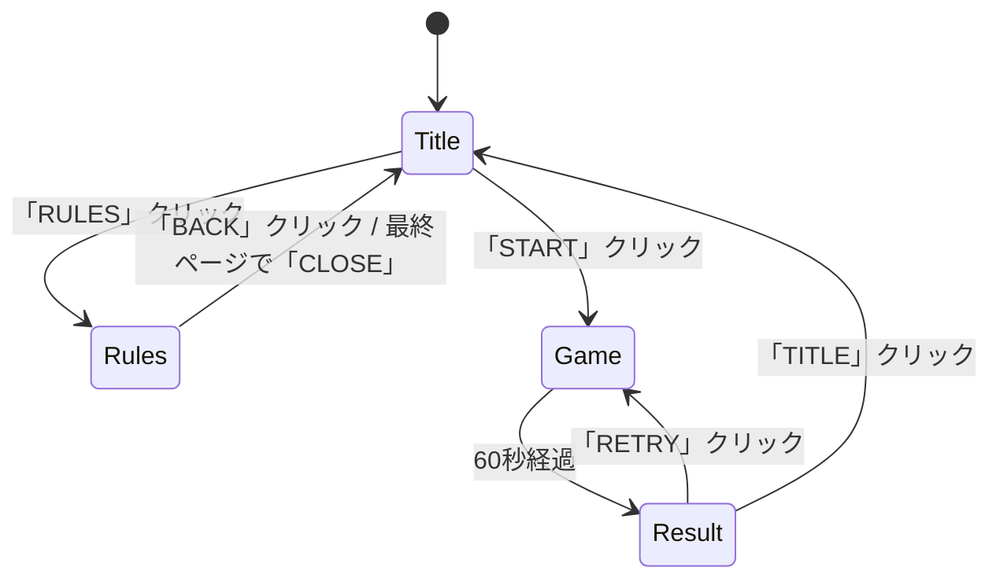

# Hanoi Cube — Pyxel Cube 版 仕様書・設計書

ブラウザだけで遊べる Hanoi Cube。カメラ・AprilTag 付きの箱・iPad コントローラを使わず、
Pyxel Cube(Pyxel のソフトウェアレンダリング 3D 拡張)で盤面を描画し、**マウス/タッチのドラッグ&ドロップ**で箱を動かす。
GitHub Pages で公開し、誰でも URL を開くだけでプレイできる状態を目標とする。

本書は既存の [specification.md](specification.md)(ブース版)の**派生仕様**である。ルール・盤面表現・判定は既存の正を
そのまま使い、変わるのは「入力手段」「描画エンジン」「配信形態」の3点だけである。

| 正となる文書 | 本書での扱い |
|---|---|
| [game/hanoi_arrange_rules.md](game/hanoi_arrange_rules.md) | ルール・得点は一切変えない |
| [contracts/board.md](contracts/board.md) | 盤面文字列 `LMS//L` 形式をそのまま使う |
| [contracts/game-core-api.md](contracts/game-core-api.md) | `judge()` / `score()` / `min_path()` / 事前計算テーブルをそのまま import する |
| [specification.md](specification.md) §5 | 画面構成の原型。本書 §3 で差分を定義する |

---

## 0. 絶対規則(本派生に固有)

1. **既存コードを変更しない。** `server/` `frontend/` `cloud/` `docs/contracts/` には触れない。Pyxel 版は `pyxel_app/` に閉じる。
   純ロジック(`server/app/core/`)は **import して使う**だけで、改変が必要になったら handoff に「要判断」として記録し、本体側の合意を取ってから行う。
2. **Pyxel ランタイム(wheel)はリポジトリ側で固定する。** Pyxel の cube ブランチは「API 策定中」であり、CDN・Web Launcher 等の
   「常に最新版を読む」経路は使わない。更新は §8.3 の手順で意図的に行う。
3. テストは実装と同じセッションで書く(CLAUDE.md 規則 2 を踏襲)。`make check` に `pyxel_app/` の lint・型・テストを含める。

---

## 1. スコープ

### 1.1 含む

- 画面: タイトル → ルール説明 → ゲーム(60秒) → リザルト。すべて**クリック/タップ**で遷移する
- **日本語 UI(既定)と英語 UI の切替**。BDF ビットマップフォントを同梱して `pyxel.Font` で描画する(§3.6)
- 3D 盤面(A/B/C 塔 + 待機エリア + 箱 9 個)の描画と、箱のドラッグ&ドロップ
- 判定ボタンによる判定、得点・失敗数の集計(既存 `judge()` をそのまま使用)
- 残り時間・カウントダウン・判定フィードバック演出
- 効果音(Pyxel 内蔵シンセで簡易に再現)
- GitHub Pages への自動デプロイ

### 1.2 含まない(第2段以降。本書 §11 に候補として残す)

- ランキング・記録画面・Firestore への保存・名前入力・QR 画面
- 練習モード(制限時間なし)※要判断 #1
- BGM、管理画面、アトラクトモード

---

## 2. 構成

### 2.1 ディレクトリ

```
hanoi-cube/
├── server/app/core/          既存。判定・盤面ユーティリティ・precompute.json(変更しない)
├── pyxel_app/                新規。本書の対象
│   ├── main.py               エントリ。pyxel.init / 画面状態機械の駆動
│   ├── screens/              画面ごとのクラス(title / rules / game / result)
│   ├── scene/                Cube シーン(mat / box / camera / picking)
│   ├── input/                マウス入力 → ドラッグ状態機械
│   ├── session.py            1プレイの状態(タイマー・得点・判定済み集合・失敗数)
│   ├── sfx.py                効果音定義
│   ├── assets/               フォント・テクスチャ(あれば)
│   ├── runtime/              ★固定ランタイム(コミットする)
│   │   ├── pyxel.js          cube ブランチからコピー(PYXEL_WHEEL_PATH 書き換え済み)
│   │   ├── pyxel.css
│   │   ├── import_hook.py
│   │   ├── images/           7ファイル
│   │   ├── pyxel-3.0.0-cp311-abi3-emscripten_5_0_3_wasm32.whl
│   │   └── VERSION.md        元コミット SHA・ビルド日・ビルド環境
│   ├── web/index.html        公開ページのテンプレート
│   ├── tests/                pytest
│   └── pyproject.toml        ruff / mypy / pytest 設定(server と同じ厳しさ)
└── .github/workflows/pyxel-pages.yml   静的サイト組み立て → GitHub Pages
```

### 2.2 純ロジックの共有方法

Pyxel Web(Pyodide)では `import` されたモジュールを `import_hook.py` が実行時に HTTP で取りに行く。
データファイル(`precompute.json`)は import 経路に乗らないため、**`pyxel package` で `.pyxapp`(zip)にまとめて配信する**。

- ビルド時(CI と `make pyxel-site`)に `server/app/core/` を `pyxel_app/_core/app/core/` へコピーしてから `pyxel package` を実行する
  (コピー先は `.gitignore`)
- `.pyxapp` は展開後に**起動スクリプトのディレクトリだけ**が `sys.path` に入る(Pyxel `cli.py` の `play_pyxel_app`)。
  そのため `main.py` 冒頭で次の順に `sys.path` を補う: ① `Path(__file__).parent / "_core"`(パッケージ実行時)
  ② `Path(__file__).parents[1] / "server"`(リポジトリから直接実行時)。存在する方だけを追加し、どちらにも `app.core` が無ければ起動時エラーにする
- `load_table()` は `Path(__file__).parent / "data" / "precompute.json"` を読むため、zip 展開後も相対関係が保たれていれば動く
- `app/core` は pydantic に依存する。Pyodide には pydantic が同梱されているので `<pyxel-play packages="pydantic">` で読み込む
  (`pyxel.js` の `packages` 属性 → `pyodide.loadPackage`)。初回ロードが数秒延びる。許容できなければ要判断 #3

### 2.3 ランタイムの固定(§0-2)

`pyxel_app/runtime/` にコミットした wheel **だけ**を読む。`index.html` は相対パスで `runtime/pyxel.js` を参照し、
`https://cdn.jsdelivr.net/gh/kitao/pyxel/...` は**使用禁止**(リリース版 2.9.x を読んでしまい `pyxel.cube` が無い)。

`VERSION.md` に以下を残す。

```
source: https://github.com/kitao/pyxel/tree/cube @ f731329 (2026-08-12)
built:  2026-08-23 macOS 15 / Apple Silicon, rust nightly-2026-07-14, emscripten 5.0.3, Pyodide 314.0.2
```

---

## 3. 画面仕様

### 3.1 画面遷移



- 入力は**マウス左ボタンのみ**(タッチはブラウザがマウスに変換する)。キーボードは補助(Enter=判定、Esc=タイトル)で必須にしない
- 画面解像度: `pyxel.init(320, 240, fps=60)`(要判断 #4)。ブラウザ側で整数倍に拡大される。
  **Pyxel の既定 fps は 30** なので `fps=60` を必ず明示する(§6.4 の時間計測・§10 の性能目標はこの前提)
- 共通デザインは既存仕様 §5.1 を踏襲(レトロアーケード、基調色 `#438532` は Pyxel の 16 色パレットに無いため、`pyxel.colors` で 1 色を差し替えて用意する)

### 3.2 タイトル

- ロゴ/タイトル文字、点滅する「クリックでスタート」、ボタン「スタート」「ルール」、右上に言語切替「JA / EN」(既存仕様 §5.3 と同じ位置)
- Pyxel Web は最初のクリックまで音声が出せない(`pyxel.js` が click 待ちをする)ため、タイトルの最初のクリックがそのまま音声解放を兼ねる

### 3.3 ルール説明

- 既存仕様 §5.4 の4ページ構成(概要 / 並べ方のルール / クリア可能とは / 得点とコツ)。文言は既存 `frontend/src/i18n/` の日英を流用する
- 「<」「>」ボタンでページ送り、ページインジケーター(●○○○)、「BACK」

### 3.4 ゲーム

レイアウト(320×240):

```
┌────────────────────────────────────────┐
│ SCORE 0123        TIME 0:47     MISS 1 │  ← 上段 HUD(高さ 16)
│                                        │
│        [3D ビューポート 320×184]        │  ← A/B/C 塔(奥)、待機エリア(手前)
│                                        │
│ [TITLE]                      [ JUDGE ] │  ← 下段(高さ 24)
└────────────────────────────────────────┘
```

- 入場時に「3」「2」「1」「GO!」(各 1 秒)。カウントダウン中は**ドラッグ可・判定不可**(既存 §5.6 と同じ)
- 残り時間 1:00 → 0:00。残り 10 秒で数字を赤点滅
- 「JUDGE」クリックで判定。判定後 0.5 秒のクールダウン
- フィードバック: `scored` → `+N` を盤面上に大きく表示+成功音 / `unclearable` → 「MISS」赤表示+失敗音+MISS カウント+1 /
  `duplicate_same` `duplicate_mirror` → 「ALREADY」黄表示(0点・失敗にも数えない)
- 判定済み盤面は**判定後も崩さなくてよい**(既存と同じ)。プレイヤーが次の配置へ自由に並べ替える
- 「TITLE」クリックで中断確認なしにタイトルへ(要判断 #5)
- 0:00 で自動的にリザルトへ。タイムアップ直前のクリックは押下時刻がタイムアップ前なら有効

### 3.5 リザルト

- 表示: SCORE、MISS、判定回数、今回の最高得点盤面(1 件、盤面文字列と得点)
- ボタン: 「RETRY」「TITLE」
- ブラウザ `localStorage` に自己ベストを保存して表示(要判断 #6。Pyodide の `js` モジュールで可能)

### 3.6 文言と日本語フォント

- 文言は `i18n.py` に JA/EN の辞書として持ち、描画側はキーで引く。既存 `frontend/src/i18n/` の文言を流用し、
  ボタン名など Pyxel 版固有のキーだけ追加する。両言語でキー集合が一致することをテストで検証する
- 日本語は BDF ビットマップフォント **M+ BITMAP FONTS 10px(`assets/umplus_j10r.bdf`、P1 で決定。ライセンスは
  `assets/LICENSE_umplus_j10r.txt`。再配布・改変・商用とも自由)**を `pyxel.Font` で描画する。英語は同じフォントで統一する
  (内蔵 4×6 フォントは HUD の数字など小さい表示にのみ使う)。8px 系(美咲 / k8x12)は可読性とライセンス確認の手間から見送った
- 320×240 では和文 10px が 1 行 32 文字(行送り 12px)。ルール説明は 1 ページ 8 行以内に収める
- Pyxel Web では `.pyxapp` に同梱されるため追加の読み込み手順は不要

---

## 4. 盤面操作(ドラッグ&ドロップ)仕様

### 4.1 3D 配置

- ワールド座標: マット中央を原点、+y 上、カメラは正面やや上から見下ろす(`Mat4.look_at`)。
  数値は既存 `frontend/src/three/layout.ts` のマットレイアウト(mm)を**そのまま 1/100 スケール**で流用する(塔間隔・待機エリア位置が実物と一致する)
- 箱: サイズ L/M/S = 一辺 75/50/30 mm 相当の立方体。色分け(L=青系, M=緑系, S=黄系 ※暫定)。各サイズ 3 個、計 9 個
- 塔: マット上の 3 本の円柱マーカー(A/B/C のラベル付き)。箱は塔の中心に積み上がる
- 待機エリア: 手前に 9 スロット(サイズごとに 3 列)。ゲーム開始時は全箱がここにある
- 影は落とさない(ソフトウェアレンダリングの負荷を抑える)。`Shading` の平行光源のみ

### 4.2 掴める箱

物理の制約を再現する。

- **塔上の箱: 一番上の 1 個だけ**掴める(下の箱はクリックしても反応しない)
- **待機エリアの箱: すべて**掴める
- ドラッグ中は箱を持ち上げ(y を +1 箱分)、マウス位置に追従させる

### 4.3 ピッキング(クリック → 箱)

1. マウス座標(ビューポート内ピクセル)→ NDC → カメラ逆行列でワールド空間のレイ(origin, direction)を求める
   (`Camera.fov` / `near` / `transform` と `Mat4.inverse()` から自前計算。Cube には画面→レイの API が無い)
2. `scene.raycast(origin, direction)` で最初に当たった箱のコライダーを取得(各箱に `Collider` を付ける。タグで「掴める/掴めない」を区別)
3. 当たった箱が §4.2 の条件を満たせば drag 開始

### 4.4 ドロップ先の決定

- マウス解放時、レイとマット平面(y=0)の交点を求め、**最も近い塔または待機スロット**を候補にする(距離しきい値あり。外れたら元の位置へ戻す)
- 塔への配置は**配置ルール(ルールブック §3)を満たすときのみ**許可する
  - 上に置く箱は下の箱より小さい
  - 同じサイズが同じ塔に無い
  - 3 個まで
- 違反時は箱を元の位置へ戻し、失敗音。**盤面は変化しない**(不正盤面は判定エンジンに渡さない。board.md「不正盤面」節)
- 待機エリアへは空いているスロット(同サイズ列)へ戻す。常に許可
- ドラッグ中の塔・スロットはハイライト(置けるなら緑、置けないなら赤)

### 4.5 ドラッグの状態機械

```
Idle ──(mouse down on pickable box)──▶ Dragging ──(mouse up, legal)──▶ Idle(盤面更新, 配置音)
                                          │
                                          └──(mouse up, illegal / 範囲外)──▶ Idle(元位置へ戻す, 失敗音)
```

- `Dragging` 中に判定ボタンは押せない(判定は「手を離した盤面」に対して行う)
- ウィンドウ外で mouse up した場合は illegal 扱いで戻す

### 4.6 盤面文字列の導出

塔ごとに下から上へサイズ文字を並べ、`format_board()`(既存)で `LMS//L` 形式にする。
待機エリアの箱は含めない(board.md §3)。§4.4 のガードにより、導出される文字列は常に合法盤面である
(`is_legal_board()` を assert で二重確認する)。

---

## 5. 判定・得点

既存 `app/core/engine.judge()` をそのまま呼ぶ。呼び出し側(`session.py`)が保持するもの:

| 状態 | 内容 |
|---|---|
| `judged_keys` | 判定済み canonical_key の集合 |
| `judged_boards` | 判定済み生盤面文字列の集合 |
| `score` | 合計得点 |
| `fail_count` | `unclearable` の回数 |
| `judge_count` | 判定回数 |
| `started_at` / `deadline` | `time.monotonic()` ベースの秒(§6.4。フレーム数で数えない) |

`scored` / `duplicate_*` の盤面は両集合へ追加、`unclearable` は `fail_count += 1`
(既存 `server/app/state/machine.py` の `_apply_judgement()` と同じ規則。ロジックを重複させないため、
この部分だけ **`machine.py` から関数として切り出して共有したい** → 要判断 #7。切り出すまでは `session.py` に同じ規則を書き、テストで既存の挙動と照合する)。

---

## 6. 設計

### 6.1 モジュール責務

| モジュール | 責務 | Pyxel 依存 | テスト方針 |
|---|---|---|---|
| `main.py` | `pyxel.init` / `run`、画面スタックの駆動 | あり | 手動 |
| `screens/*` | 各画面の update/draw、ボタン当たり判定 | あり | ボタン矩形のユニットテスト |
| `scene/layout.py` | mm → ワールド座標、塔・スロット座標 | **なし** | 座標変換・最近傍スロット |
| `scene/picking.py` | 画面座標 → レイ、マット平面との交点 | **なし**(`Mat4`/`Vec3` のみ) | 既知の行列で往復検証 |
| `scene/board_scene.py` | Node ツリー、箱の位置更新、ハイライト | あり | 手動 |
| `input/drag.py` | §4.5 の状態機械 | **なし** | 状態遷移の全分岐 |
| `session.py` | §5 の集計 | **なし** | 既存 machine.py と同結果になることを照合 |
| `board_state.py` | 9 箱の所在(塔 or スロット)→ 盤面文字列、配置ルール検証 | **なし** | 全 512 盤面の往復、違反ケース |

Pyxel に依存しない層を厚くし、pytest で回す。Pyxel 依存層は薄いラッパーに留める。

### 6.2 画面状態機械

画面は `Screen` 基底クラス(`update()` / `draw()` / `on_click(x, y)`)の実装で、`main.py` が現在の画面を 1 つ持つ。
遷移は画面が `next_screen` を返す方式(グローバルな状態機械を別に持たない)。

### 6.3 Cube シーン構成

```
Scene(Node)                    camera, shading
├── Mat(Node)                  マット平面 + 塔マーカー + スロットマーカー
├── Box(Node) × 9              transform, collider(tag="box"), size, location
└── Highlight(Node)            ドロップ候補の枠(描画のみ、collider なし)
```

- `Box.on_draw()` は `self.box(Mat4.IDENTITY, Vec3(size,size,size), color)`。将来テクスチャ化する場合は `Mesh` に差し替える
- 位置は指数平滑化(既存 `frontend/src/three/smoothing.ts` と同じ λ=12)で動かし、配置時に「スッと収まる」感を出す

### 6.4 時間

`pyxel.init(fps=60)` により 60 回/秒を目標に `update()` が呼ばれるが(既定は 30。§3.1)、ブラウザで処理落ちすると update 自体が遅れるため、
残り時間の真値は `pyxel.frame_count` ではなく **`time.monotonic()`**(Pyodide で利用可)で測る。
描画上のカウントダウンは秒単位で丸める。

### 6.5 効果音

Pyxel 内蔵のサウンド定義(`pyxel.sounds[n].set(...)`)で、既存仕様 §5.12 の SFX 一覧のうち
「ボタン」「配置」「失敗」「判定成功」「判定済み」「カウントダウン」「タイムアップ」の 7 種を用意する。

---

## 7. 配信・デプロイ

### 7.1 静的サイトの組み立て(`make pyxel-site`)

```
site/
├── index.html                pyxel_app/web/index.html をコピー
├── runtime/                  pyxel_app/runtime/ をそのままコピー
└── hanoi_cube.pyxapp         pyxel package の成果物(pyxel_app + server/app/core + precompute.json)
```

`index.html` の要点:

```html
<link rel="stylesheet" href="runtime/pyxel.css">
<script src="runtime/pyxel.js"></script>
<pyxel-play root="." name="hanoi_cube.pyxapp" packages="pydantic"></pyxel-play>
```

仮想ゲームパッドは不要なので `gamepad` 属性を付けない(付けると `"enabled"` のときだけタッチ端末に表示される)。

### 7.2 GitHub Actions(`.github/workflows/pyxel-pages.yml`)

- トリガー: `main` への push のうち `pyxel_app/**` `server/app/core/**` の変更時、および手動
- 手順: `actions/setup-python` → `pip install pyxel`(**パッケージ化には PyPI のリリース版で十分**。`pyxel package` は zip を作るだけ)
  → `make pyxel-site` → `actions/upload-pages-artifact` → `actions/deploy-pages`
- Rust / Emscripten は **CI でも使わない**(wheel はコミット済み)。所要 1〜2 分
- 公開 URL: `https://daydelight-com.github.io/hanoi-cube/`(リポジトリ設定で Pages のソースを「GitHub Actions」にする)

### 7.3 `pyxel-cube-example` リポジトリの扱い

動作確認用として残す。本番の配信元は hanoi-cube に一本化し、example 側の README に本書へのリンクを置く。

---

## 8. セットアップ手順(開発者向け)

開発者は 2 種類に分かれる。**ほとんどの人は 8.1 だけでよい。**

| 役割 | 必要なもの | 所要 |
|---|---|---|
| 8.1 アプリ開発者 | Python 3.12 + uv + ブラウザ | 5 分 |
| 8.2 ランタイム更新担当 | 上に加えて Rust nightly・cmake・Emscripten 5.0.3 | 初回 1〜2 時間(ビルド含む) |

共通の前提: リポジトリを clone 済み、`uv` 導入済み(hanoi-cube 本体と同じ)。

### 8.1 アプリ開発者(ランタイムはビルドしない)

#### 8.1.1 ネイティブ実行用 wheel の入手

手元で `python pyxel_app/main.py` を動かすには、ブラウザ用(WASM)とは別にネイティブ用の wheel が必要。
hanoi-cube の GitHub Release `pyxel-cube-runtime-<日付>` に添付して配布する(初回は 8.2 担当者が作る。
`pip install pyxel` で入る PyPI 版には cube が無いため、この wheel を使うこと)。

| OS | wheel ファイル名(例) |
|---|---|
| macOS (Apple Silicon) | `pyxel-3.0.0-cp311-abi3-macosx_11_0_arm64.whl` |
| Windows (x64) | `pyxel-3.0.0-cp311-abi3-win_amd64.whl` |
| ブラウザ(共通) | `pyxel-3.0.0-cp311-abi3-emscripten_5_0_3_wasm32.whl`(リポジトリにコミット済み。入手不要) |

macOS(Apple Silicon)。`pyxel_app/pyproject.toml` の `[tool.uv.sources]` が Release の wheel URL を指しているので `uv sync` だけでよい:

```bash
cd pyxel_app && uv sync
```

Windows (PowerShell)。Windows 用 wheel は未作成のため、`pyproject.toml` の `pyxel` 依存はプラットフォームマーカーで macOS arm64 に限定している。
Windows 用 wheel が Release に追加されたら `[tool.uv.sources]` に同様の行を足す。それまでは手動で入れる:

```powershell
cd pyxel_app; uv sync; uv pip install "<Release の Windows wheel URL>"
```

確認(両 OS 共通):

```bash
uv run python -c "import pyxel, pyxel.cube; print(pyxel.VERSION)"
```

`3.0.0` と出れば OK。`pip install pyxel` で入る PyPI 版(2.9.x)には `pyxel.cube` が**無い**ので、うっかり入れ替えないこと。

#### 8.1.2 ネイティブで実行

```bash
cd pyxel_app && uv run python main.py
```

(`main.py` が `sys.path` に `../server` を追加するので、`app.core` はそのまま import できる。Q で終了)

#### 8.1.3 ブラウザで実行(公開と同じ経路)

```bash
make pyxel-serve
```

(`make pyxel-site` で `site/` を組み立ててから `:8081` で配信する。Firestore エミュレータの 8080 と衝突しないよう 8081 を既定にした。
`make pyxel-serve PYXEL_PORT=9000` で変更可)

Windows (PowerShell) で `make` が無い場合:

```powershell
cd pyxel_app; uv run python ..\scripts\build_pyxel_site.py; cd ..; python -m http.server 8081 --directory site
```

`http://localhost:8081` を開く。ブラウザのコンソールに `Launch Pyxel 3.0.0 with Pyodide 314.0.2` と出ていれば固定ランタイムを読めている
(`2.9.x` と出たら CDN を読んでいるので `index.html` を疑う)。`file://` では動かない(fetch が失敗する)。

#### 8.1.4 チェック

```bash
make check
```

`pyxel_app/` の ruff / mypy strict / pytest が含まれる。

### 8.2 ランタイム更新担当(cube ブランチをビルドする)

cube ブランチの更新を取り込むとき、または初回に wheel を作るときだけ必要。**Windows での WASM ビルドは未検証**
(Pyxel の Makefile は Git Bash 前提で書かれており理屈上は可能だが、本プロジェクトでは macOS で行うことを推奨する。
要判断 #9)。

#### 8.2.1 ツールの導入

macOS(Homebrew):

```bash
brew install rustup cmake
```

```bash
echo 'export PATH="/opt/homebrew/opt/rustup/bin:$PATH"' >> ~/.zshrc && exec zsh
```

Homebrew の rustup は keg-only で PATH に入らないため、この 1 行が無いと `cargo: command not found` になる(S26 の実体験)。

Windows(PowerShell、winget):

```powershell
winget install --id Rustlang.Rustup
```

```powershell
winget install --id Kitware.CMake
```

```powershell
winget install --id Git.Git
```

Rustup は新しいターミナルを開けば PATH に入る。以降の `make` は **Git Bash** で実行する(PowerShell では動かない)。

Emscripten は **5.0.3 固定**(Pyodide 314.0.2 が使う版。ずれると実行時に落ちる):

macOS:

```bash
git clone https://github.com/emscripten-core/emsdk.git ~/emsdk && cd ~/emsdk && ./emsdk install 5.0.3 && ./emsdk activate 5.0.3
```

Windows(PowerShell):

```powershell
git clone https://github.com/emscripten-core/emsdk.git $HOME\emsdk; cd $HOME\emsdk; .\emsdk.bat install 5.0.3; .\emsdk.bat activate 5.0.3
```

#### 8.2.2 cube ブランチの取得と venv

両 OS 共通(Windows は Git Bash):

```bash
git clone -b cube https://github.com/kitao/pyxel.git ~/workspace/pyxel-cube && cd ~/workspace/pyxel-cube && ./scripts/setup_venv
```

Rust ツールチェーンは `rust-toolchain.toml`(nightly 固定)により初回の `rustup show` で自動取得される:

```bash
cd ~/workspace/pyxel-cube && rustup show
```

#### 8.2.3 WASM wheel のビルド

macOS:

```bash
cd ~/workspace/pyxel-cube && source .venv/bin/activate && source ~/emsdk/emsdk_env.sh && make build-wasm
```

Windows(Git Bash):

```bash
cd ~/workspace/pyxel-cube && source .venv/Scripts/activate && source ~/emsdk/emsdk_env.sh && make build-wasm
```

成果物: `wasm/pyxel-3.0.0-cp311-abi3-emscripten_5_0_3_wasm32.whl`。`wasm/pyxel.js` の `PYXEL_WHEEL_PATH` は自動で書き換わる。
初回は 10〜30 分(Rust の std を wasm 向けに再ビルドするため)。

#### 8.2.4 ネイティブ wheel のビルド(8.1.1 の Release 添付用)

macOS:

```bash
cd ~/workspace/pyxel-cube && source .venv/bin/activate && make build
```

Windows(Git Bash):

```bash
cd ~/workspace/pyxel-cube && source .venv/Scripts/activate && make build
```

成果物は `dist/`。macOS の wheel は Mac で、Windows の wheel は Windows でしか作れない。
どちらか一方の担当者しかいない場合は GitHub Actions の `windows-2022` / `macos-15` ランナーで `make` を回す(Pyxel 本家の `build.yml` と同じ手順。要判断 #8)。

#### 8.2.5 リポジトリへの反映

```bash
cd ~/workspace/pyxel-cube/wasm && cp -R pyxel.js pyxel.css import_hook.py images pyxel-3.0.0-*.whl ~/workspace/hanoi-cube/pyxel_app/runtime/
```

1. `pyxel_app/runtime/VERSION.md` を更新(元コミット SHA・日付・環境)
2. `make pyxel-site` → ブラウザで §8.1.3 の確認(**ここで cube の API 変更によりアプリが壊れていないかを必ず確認する**)
3. ネイティブ wheel を GitHub Release `pyxel-cube-runtime-<日付>` に添付し、README の URL を更新
4. handoff に「ランタイム更新」として記録してコミット

#### 8.2.6 よくある失敗(S26 で実際に起きたもの)

| 症状 | 原因 | 対処 |
|---|---|---|
| `rustc: command not found`(macOS) | Homebrew rustup が keg-only | §8.2.1 の PATH 追記。既存ターミナルには反映されないので新しく開く |
| `pip install git+...@cube` が maturin で失敗 | `python/pyxel/README.md` が `.gitignore` 対象で、Makefile の `cp` 前提 | `make build` を使う(pip 直接は使わない) |
| ブラウザで真っ白のまま | `runtime/images/` が無く、ロゴの `load` 待ちで停止 | `images/` 7 ファイルをコピー |
| `Failed to fetch import_hook.py: 404` | `import_hook.py` 未コピー | 同上 |
| コンソールに `Launch Pyxel 2.9.9` | CDN の `pyxel.js` を読んでいる | `index.html` を相対パス参照に直す |

---

## 9. テスト

- `pyxel_app/tests/` を pytest で。Pyxel 非依存層(§6.1)を網羅する
  - `board_state`: 全 512 合法盤面について「箱の所在 → 盤面文字列 → `board_index` → 復元」が一致。配置ルール違反 3 種の拒否
  - `drag`: 状態機械の全遷移(legal / illegal / 範囲外 / ドラッグ中の判定ボタン無効)
  - `session`: 同じ判定列を既存 `StateMachine` に流した結果(score / fail_count / judged 集合)と一致
  - `picking`: 既知のカメラ行列で「画面中央 → 原点方向のレイ」「四隅 → 視錐台の端」
  - `layout`: 既存 `layout.ts` の定数との数値一致(mm → ワールド)
- Pyxel 依存層はブラウザでの手動確認(§8.1.3)。`make pyxel-site` の成果物に必須ファイルが揃っているかは CI でチェックする
- ブラウザ実機確認の対象: Chrome / Safari(macOS, iOS)/ Edge(Windows)。iPhone でタッチドラッグが動くことを公開前に確認

---

## 10. 非機能要件

| 項目 | 目標 |
|---|---|
| フレームレート | 60fps(M1 Mac / Chrome)。箱 9 個 + マットのソフトウェアレンダリングは 320×240 なら十分軽い見込み。30fps を下回ったら解像度を 256×192 に落とす |
| 初回ロード | Pyodide(約 10MB)+ wheel(5MB)+ pydantic。回線 50Mbps で 5 秒以内。2 回目以降はブラウザキャッシュ |
| 対応ブラウザ | WebAssembly SIMD が必要(2021 年以降の Chrome / Safari 16.4+ / Firefox / Edge) |
| オフライン | 非対応(初回ロードにネットワーク必須) |

---

## 11. 要判断(選んだデフォルトと理由)

| # | 論点 | デフォルト | 理由 |
|---|---|---|---|
| 1 | 練習モード(制限時間なし)を含めるか | **含めない** | 60 秒ゲームを「RETRY」で何度でも遊べるため代替できる。必要なら画面 1 つの追加で済む |
| 2 | 日本語 UI | **決定: 最初から日本語 UI + 英語切替(§3.6)** | ブース版が日本語であり、追加コストはフォント同梱のみ(S27 でユーザー決定) |
| 3 | pydantic を Pyodide で読み込む(ロード +数秒)か、core を pydantic 非依存にするか | **pydantic を読み込む(P1 で確定)** | core を変えない(§0-1)。P1 の実測で pydantic 5 パッケージ(約 1.9MB)の取得+展開は約 2.1 秒(ローカル配信・M1 Mac / Chrome)。許容範囲 |
| 4 | 画面解像度 | **320×240** | 3D ビューの可読性と描画負荷のバランス。HUD の文字(4×6 px)が読める最小限 |
| 5 | ゲーム中の「TITLE」で確認ダイアログを出すか | **出さない** | 誤タップの損失は 60 秒分のみ。ダイアログは操作を増やす |
| 6 | 自己ベストを localStorage に保存 | **保存する** | 実装コストが小さく、ランキング無しでも再挑戦の動機になる |
| 7 | `_apply_judgement` 相当の規則を `machine.py` から切り出して共有するか | **切り出さない(初期)** | 既存コードを触らない。`session.py` に同じ規則を書き、照合テストで守る。後日 core 側で関数化する提案を handoff に残す |
| 8 | ネイティブ wheel の配布方法 | **決定: ビルド済み wheel を GitHub Release に添付**(S27 でユーザー決定) | 開発者ごとのコンパイルを不要にする。まず macOS 用、Windows 用は必要になった時点で CI(`windows-2022`)で作る |
| 9 | Windows での WASM ビルド | **行わない(macOS または CI)** | 未検証。担当者の環境を揃える方が確実 |
| 10 | 箱の見た目 | **単色の立方体(サイズ別)** | ブース版の「ロゴ・タグ付きテクスチャ」は実物との対応付けが目的であり、Web 版には不要。テクスチャ化は `Mesh` 差し替えで後から可能 |

---

## 12. マイルストーン

セッション計画(P1〜P6 と第2段 P7〜P8)・DoD・リスクと逃げ道は [pyxel_app_development_plan.md](pyxel_app_development_plan.md) §4 を正とする
(本書には重複して書かない)。
