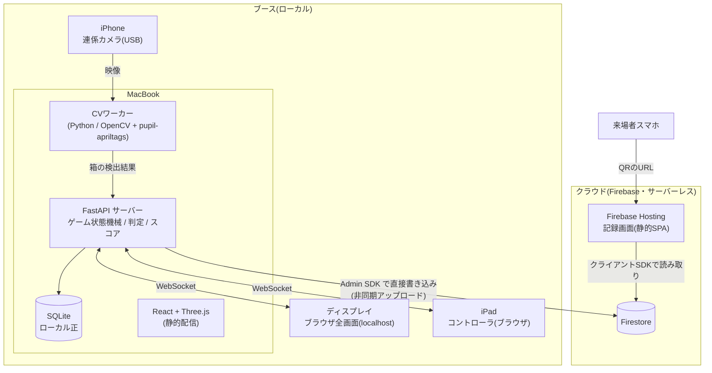
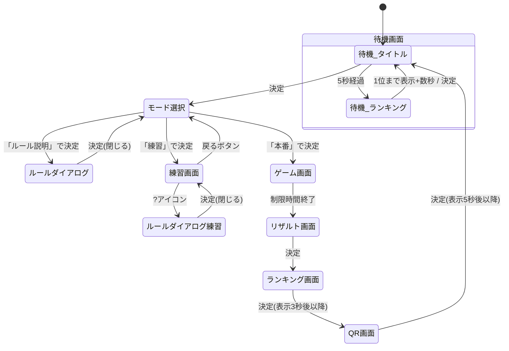

# Hanoi Cube 仕様書

PyCon JP 出展ブース向け体験ゲーム「Hanoi Cube(仮称)」のシステム仕様書。

- ゲームルールの正式定義: [docs/game/hanoi_arrange_rules.md](game/hanoi_arrange_rules.md)
- 得点表(全166クラス): [docs/game/score_ranking.md](game/score_ranking.md)

本書はシステム(ハードウェア構成・ソフトウェア・画面・通信・データ)の仕様を定める。実装には本書のレビュー後に着手する。

---

## 1. プロジェクト概要

### 1.1 目的

- PyCon JP(2日間開催)のブースで来場者にゲームを楽しんでもらう。
- 廃棄物の体積測定アプリ「Cube」および自社への興味・認知を獲得する。
- 遊んだ記録をスマホで持ち帰れるようにし(記録画面)、ブース体験後の接点を作る。

### 1.2 ゲームコンセプト

Cubeに見立てた正立方体の「箱」をハノイの塔の円盤として実際に手で動かして遊ぶ、フィジカル×デジタルのスコアアタックゲーム。箱の動きをiPhoneカメラ+AprilTagで認識し、ディスプレイ上の3D表現とリアルタイムに連動させる。

- ルールは「ハノイの塔アレンジ」(詳細は上記ルールブック)。制限時間1分で、クリア可能な配置を作って判定ボタンを押し、得点を稼ぐ。
- 得点 = 盤面の円盤(箱)総数 × 最短クリア手数。同一配置(鏡像含む)の再判定は無得点。
- 演出はレトロアーケードゲーム風。テーマカラーは Cube の `#438532`。

---

## 2. 機材・物理構成

### 2.1 機材一覧

| 機材 | 数量 | 用途 |
|---|---|---|
| 箱(大) 7.5cm角 | 3 | ゲームの「円盤」。AprilTag + ロゴ入り |
| 箱(中) 5cm角 | 3 | 同上 |
| 箱(小) 3cm角 | 3 | 同上(ロゴ視認性は不問) |
| プレイマット | 1 | A/B/C の3塔エリアを印刷した専用マット。キャリブレーション用マーカー付き |
| iPhone | 1 | 連係カメラ(Continuity Camera)としてMacに接続し、プレイエリアを撮影 |
| iPad | 1 | 操作コントローラ(←/→/決定 + 名前入力キーボード) |
| MacBook | 1 | サーバー(FastAPI)・画像認識・画面レンダリングのホスト |
| ディスプレイ | 1 | 来場者向けゲーム画面(Macに接続、ブラウザ全画面表示) |

### 2.2 ブースレイアウト・カメラ

- iPhone は**斜め上からの俯瞰**でプレイマット全体を撮影する(三脚等で固定)。
  - 塔に配置済みの箱に加え、**未配置の箱(手元の待機エリア)も画角に収める**。ゲーム画面には全箱のリアルタイム位置を3D表示するため。
  - 俯瞰角度の目安は水平から30〜45度。上面と正面〜側面の2〜3面が同時に見え、AprilTag検出機会が最大化される。
  - 接続は**USBケーブル推奨**(ワイヤレス連係カメラは電池・帯域の面で終日運用に不安)。iPhoneは常時給電。
- プレイマットには A/B/C 3塔の枠と、その手前に**未配置の箱の待機エリア**を印刷し、1枚のマットに収める(確定)。四隅には**キャリブレーション用AprilTag**を印刷する。カメラ→マット平面のホモグラフィを起動時に自動推定し、設営のたびの手動調整を不要にする。待機エリアを含めてマット全体がカメラ画角に収まること。
- 照明: 会場照明の反射を避けるため、タグ面はマット(非光沢)仕上げとする。

### 2.3 箱とAprilTagの貼付方針(提案)

前提: 同サイズの箱が3個ずつ存在するため、**タグIDで箱の個体を一意に識別**する必要がある(サイズはID→箱マスタで引く)。

前提2: 箱は**ひっくり返して置かれることも許容**する(プレイヤーは向きを気にしない)。したがって「タグのない面」を1面でも作ると、その面がカメラ側を向いたときに検出が途切れる。特に積まれた下段の箱は側面しか見えないため、6面すべてにタグが必要である。

**確定方針**:

| 箱 | 貼り方 | ロゴ |
|---|---|---|
| 大(7.5cm)・中(5cm) | **6面すべて、各面の右上隅にタグ1枚** | 各面の中央に配置(下記サイズ目安) |
| 小(3cm) | **6面すべて、各面ほぼ全面にタグ1枚**(約2.5cm角) | なし |

- AprilTagは1枚で「ID + 6自由度の姿勢」が完全に取れるため、機能上は1面1枚で成立する。盤面確定・判定に使うのは手を離した静止状態の映像であり、このとき遮蔽はない。また俯瞰カメラからは通常2〜3面が同時に見えるため、1面1枚でも箱あたり2〜3枚のタグが見える(面をまたいだ冗長性がある)。
- 1隅しか使わないぶんタグを大きくし、検出可能距離を稼ぐ(下記)。ロゴ領域も最大化される。
- 2枚目(対角隅)の追加は、手で掴んでいる最中の追従性の保険。**PoC(§11 M1)で持ち運び中の追従感を確認し、不足なら対角にもう1枚追加する**(ID表の拡張のみで対応可能な設計とする)。
- ひっくり返し・回転への追従: どの面が上/正面になっても必ずタグが見える。持ち上げて裏返す最中も、見えているいずれかのタグで追跡が継続する。

詳細:

- **タグファミリー**: `tag36h11`(確定)。検出器はまず黒枠正方形を探すため、同じシール寸法なら黒枠を大きく取れるファミリーほど遠距離・小サイズに強い。tag36h11は黒枠がシール footprint の約8割を占め(tagStandard41h12は約6割)、本ゲームのボトルネックである中箱の小タグで有利。最も実績のあるデフォルトファミリーで、ID数587は必要数(最大108+マット4)に十分。検出は Python の `pupil-apriltags`。
- **ID割当**: (箱個体 × 面)ごとにユニークIDを割る(9箱 × 6面 = 54 ID。対角隅を追加する場合は隅位置も含め最大108 ID)。ID→(箱個体, サイズ, 面, 隅位置)のマスタを持つことで、タグ1枚の検出だけで「どの箱が・どの面を・どの向きで」見せているかが一意に決まる。
- **サイズ目安**(シール=裁ち線サイズ。白余白はシール内に確保済み):
  - 7.5cm箱(大): シール24mm角(黒枠正方形 約16mm)を右上隅に。ロゴは面中央に約5cm角を確保可能。
  - 5cm箱(中): シール24mm角(黒枠 約16mm)を右上隅に。ロゴは面中央に約3cm角を確保可能。
  - 3cm箱(小): シール30mm角(黒枠 約21mm)を面中央に(ほぼ全面)。
  - 黒枠16mmは「俯瞰45°の射影・ブレ・印刷品質を織り込んだ安全下限」として設定した値。これ以上の縮小は非推奨。
- **検出可能距離の目安**: 黒枠が画像上で1辺 約25px 以上必要。箱が小型化したぶんプレイエリア全体もコンパクトになるため、カメラを近づけて撮影する(目安: 画角幅70〜80cm)。1080pで幅75cmを撮る場合 1px≈0.39mm なので、大・中の黒枠16mm≈41px(正面)、45°の射影でも約29pxとなり成立する見込み。ただし**PoC(§11 フェーズ2)で実測必須**。不足する場合は「対角隅への2枚目追加」「カメラをさらに寄せる」「4K/30fpsへの引き上げ」の順で対処する。カメラは1080p/30fpsを基本とする。
- 印刷は黒の濃度を高く、ラミネートするならマット(非光沢)で。黒枠の外側の白余白(クワイエットゾーン)は合計4mm以上(公式タグ画像内の1セル+シール外周余白。印刷シートは自動で確保済み)。ロゴ・箱の稜線をシールに接触させない。
- **印刷シートの生成**: `scripts/generate_tag_sheet.py` が印刷用PDF(`output/apriltag_sheet.pdf`、実寸A4・貼付先ラベル付き)とIDマスタ(`output/tag_master.json`)を生成する。タグサイズ等の仕様変更時はスクリプト冒頭の設定を書き換えて再実行する(生成後に pupil-apriltags による全タグ検出の自己検証つき)。

---

## 3. システム構成

### 3.1 全体アーキテクチャ



### 3.2 構成の要点(当初案への提案含む)

当初案(FastAPI / React+Three.js / iPhone連係カメラ / iPad WebSocket / ディスプレイはlocalhost表示)は妥当。その上で以下を推奨する。

1. **ローカル完結を原則、クラウドは非同期連携**
   ゲーム進行(認識・判定・画面更新)は会場ネットワークに一切依存させない。プレイ結果は確定時にクラウドへ非同期アップロードし、失敗してもゲームは止めない(後述のリトライキュー)。
2. **ランキングの正はクラウド、表示はローカルキャッシュ**(ユーザー要望の折衷)
   - 書き込み: プレイ結果はローカルSQLiteに即書き→クラウドへアップロード。
   - 読み出し: ランキング画面表示時にクラウドから取得を試み、**300ms以内に応答がなければローカルSQLiteのランキングで即表示**、取得完了後に差し替える。Macは1台のみなので通常は両者は一致する。2日間累積で保持し、リセットしない。
3. **CVワーカーはFastAPIと同一プロセスにしない**
   30fpsの画像処理でイベントループを塞がないよう、CVは別プロセス(`multiprocessing` または別常駐プロセス)とし、検出結果(タグID・姿勢のリスト)だけをキュー経由でAPIプロセスに渡す。
4. **フロントは1つのReactアプリ、役割はURLで分岐**
   `/display`(ディスプレイ用)と `/controller`(iPad用)を同一FastAPIから配信。状態はすべてサーバー側の状態機械が持ち、両クライアントはWebSocketで購読・操作する(ディスプレイとiPadの画面不整合を構造的に防ぐ)。
5. **iPadの接続**: Macのインターネット共有(またはブース用モバイルルーター)で同一LANに接続し、`http://<MacのIP>:<port>/controller` を開く。ガイド付きアクセス(シングルアプリモード)で誤操作を防止する。
6. **クラウドは Firebase によるサーバーレス構成**(確定事項)。専用のAPIサーバー(Cloud Run等)は置かない。
   - データストア: **Firestore**。ブースMacから Firebase Admin SDK(Python・サービスアカウント認証)で直接書き込む。
   - 記録画面: **Firebase Hosting** に静的SPAとしてデプロイし、Firestore Web クライアントSDKで直接読み取る。
   - セキュリティルール: 読み取りは全員許可、クライアントからの書き込みは全面禁止(書き込みはAdmin SDK経由のみ)。
   - 来場者のスマホは会場ネットワークに依存せず、帰宅後も閲覧できる。
   - 記録画面のOGPは全プレイ共通(確定)のため、Cloud Functions 等の動的処理は一切不要。

### 3.3 技術スタック

| レイヤ | 技術 |
|---|---|
| 画像認識 | Python, OpenCV(映像取得・前処理), pupil-apriltags(検出) |
| サーバー | Python 3.12+, FastAPI, WebSocket, SQLite |
| フロントエンド | React, TypeScript, Three.js(3D表示), Vite |
| クラウド | Firestore(データストア)+ Firebase Hosting(記録画面)。サーバーレス、APIサーバーなし |
| 音 | Web Audio API(BGMはディスプレイ側、効果音はディスプレイ側・iPad側それぞれで再生) |

---

## 4. 箱認識サブシステム

### 4.1 処理パイプライン

1. **映像取得**: iPhone(連係カメラ)から1080p/30fpsで取得。
2. **タグ検出**: フレームごとにAprilTagを検出し、ID・コーナー座標・姿勢を得る。
3. **箱の同定**: ID→箱マスタで(個体, サイズ, 面)を解決。同一箱の複数タグ検出は姿勢推定に統合。
4. **座標変換**: マット四隅タグから推定したホモグラフィで、箱の位置をマット座標系(mm)に変換。高さはタグの見かけサイズ・姿勢から推定。
5. **状態推定**: 箱のマット座標を A/B/C エリアおよび待機エリアに分類。同一エリア内は高さ順に積み順を決定し、**論理盤面**(各塔の下からのサイズ列)を構成する。
6. **平滑化・安定判定**: 位置は移動平均等で平滑化。論理盤面は「N フレーム(目安: 0.3秒)連続で同一」になったときに確定盤面として更新する(手で動かしている最中のちらつきを判定に使わせない)。
7. **配信**: (a) 全箱の連続的な位置・姿勢(3D表示用、30fps目安)、(b) 確定盤面(判定用)をAPIプロセスへ送る。

### 4.2 ロバスト性の要件

- 手や体による一時的な遮蔽(タグロスト)では箱を消さない。最後の確定位置を一定時間(目安2秒)保持し、3D表示は保持位置に留める。
- 積まれた箱は下段のタグが上段に隠れる場合がある。俯瞰カメラ+側面タグで原則見えるが、ロスト時は「直前までそのエリアで確定していた箱は動いていない」と推定する。
- 配置ルール違反(小の上に大が乗っている等)を検出した場合、盤面は「不正状態」として画面に警告表示し、判定ボタンは無効化する(ルールブック§3)。
- 起動時セルフチェック: マット四隅タグが4つ検出できているか、9箱がすべて見えているかをスタッフ向けに表示する(§5.11 管理画面)。

---

## 5. 画面仕様

### 5.1 画面遷移図



- 状態機械はサーバー側で一元管理する。ディスプレイ・iPadは現在状態をWebSocketで受信して描画するのみ。
- 共通デザイン: レトロアーケード風(ドット系フォント、スキャンライン、`#438532` を基調にしたネオン/CRT調)。全ボタン操作・状態遷移で効果音を鳴らす。
- **箱の3D表示**: 3Dの箱は物理の箱と同じ見た目で描画する。**各面のロゴ・AprilTagを含めたテクスチャ**を貼り、実物との対応が一目で分かるようにする(向き・回転もタグ検出の姿勢に追従するため、画面の箱と手元の箱は同じ面が同じ向きを向く)。
  - 面レイアウト(どの面にどのタグID・どのロゴを貼るか)は、CVのIDマスタ(§2.3)と3Dテクスチャ生成で**同一のマスタデータを共用**する。物理の箱への貼付内容が変わってもマスタの更新だけで認識と表示の両方が追従する。
  - ロゴ画像の実データと各面への割付は後日確定(§10)。確定までは仮テクスチャ(サイズ別の色分け+タグ)で実装を進める。

### 5.2 待機画面(アトラクトモード)

- タイトル画面とランキング画面を交互に表示する。
  - タイトル画面: **5秒間**表示。ロゴ・タイトル・「PRESS ENTER」等の点滅表示。
  - ランキング画面: **全件を下位から順に**せり上がる演出で表示し、1位まで表示して**3秒**後にタイトル画面へ戻る。件数が増えても1周が長くなりすぎないよう、全件を約20〜30秒で流し切るペースに速度を自動調整する(実装時にチューニング)。
- 操作:
  - ランキング表示中に決定 → タイトル画面へ。
  - タイトル表示中に決定 → モード選択画面へ。
  - 矢印キーは無効。
- **待機画面に入った時点で表示言語を日本語にリセット**する(§5.13)。

### 5.3 モード選択画面

- 左から「ルール説明」「練習」「本番」の3項目を横並び表示。画面**右上に言語切替ボタン**(「JA / EN」表記)を表示。
- ←/→でフォーカス移動、決定で確定。フォーカス順は「ルール説明 → 練習 → 本番 → 言語切替(右上)」の一列として扱い、←/→で行き来する(端でループするかは実装時に調整)。
- 「ルール説明」→ ルールダイアログを開く(§5.4)。「練習」→ 練習画面。「本番」→ ゲーム画面。
- **言語切替**: フォーカスして決定を押すたびに日本語⇄英語をトグルし、即座に全体へ反映する(§5.13)。

### 5.4 ルールダイアログ

- ゲームルールを複数ページ(目安4〜6ページ: 概要 / 並べ方のルール / クリア可能とは / 得点とコツ)で説明するモーダル。
- ←/→でページ切替、決定で閉じる。ページインジケーター(●○○)を表示。
- モード選択画面と練習画面(?アイコン)の両方から呼び出される。閉じると呼び出し元に戻る。

### 5.5 練習画面

- 本番と同じ盤面表示・判定・スコア加算を行うが、**制限時間なし**。スコアはランキング・記録に残らない。
- レイアウト: 画面上部左に「戻る」ボタン、上部右に「?」アイコン。中央に3D盤面、スコア表示。
- 操作(選択状態モデル):
  - ←/→を押すと**選択状態が有効化**され、「戻る」「?」にフォーカスが当たる(←→でフォーカス移動)。
  - **箱を動かすと選択状態は解除**される(CVが箱の移動を検出したら解除)。
  - 選択状態で決定 → フォーカス中のボタンを実行(戻る=モード選択へ / ?=ルールダイアログ)。
  - 非選択状態で決定 → **判定**を実行(本番と同じ判定・加算演出)。

### 5.6 ゲーム画面(本番)

- 入場時に「3」「2」「1」「GO!」のカウントダウン演出を表示し、GOと同時に計測開始。カウントダウン中は判定不可。箱の3D表示はカウントダウン中も動く。
- 表示要素:
  - スコア(現在の合計得点)
  - 残り時間(1:00からのカウントダウン。残り10秒で強調演出)
  - 盤面の3D表示(A/B/C塔+待機エリアの全箱のリアルタイム位置)
  - 判定結果のフィードバック(成功: 獲得点数 `+N` と成功演出 / 失敗: 失敗演出 / 判定済み: 「判定済み」表示)
  - 失敗数(判定失敗のカウント。同点時の順位決定に使用)
- 操作: 決定=判定。矢印は無効。判定は確定盤面(§4.1-6)に対して行う。連打防止のため判定後の短いクールダウン(目安0.5秒)を設ける。
- 判定処理はルールブック§5〜6に完全準拠(クリア可能性、得点=箱数×最短手数、既判定・鏡像の重複排除、失敗の記録)。全512盤面の判定結果・最短手数・最短手順は**事前計算テーブル**として持つ(実行時探索はしない)。
- 時間切れでリザルト画面へ自動遷移。時間切れ直前に押された判定は、押下時刻がタイムアップ前なら有効。

### 5.7 リザルト画面(名前入力)

- 表示: 今回のスコア、失敗数、順位(現時点の暫定順位)、名前入力欄、「入力」ボタン、「決定」ボタン。
- 名前入力フロー:
  1. リザルト画面に入ると iPad が名前入力モードになり、iPadにテキストフィールドとソフトウェアキーボードが表示される。
  2. 入力内容はリアルタイムでディスプレイの入力欄にミラー表示される。
  3. キーボードの「完了」でキーボードを閉じる(iPadは←/→/決定のボタン表示に戻る)。
  4. ディスプレイの「入力」ボタンにフォーカスして決定すると、再度キーボードを開いて修正できる。
  5. 「決定」ボタンで名前を確定し、ランキング画面へ。
- バリデーション: 1文字以上10文字以下。0文字時は「決定」を無効化。不適切語のフィルタは行わない(スタッフ運用でカバー)。
- 名前確定時にプレイ結果を保存し(ローカルSQLite)、クラウドへのアップロードをキューに積む。

### 5.8 ランキング画面

- 表示項目: 順位 / 名前 / スコア / 失敗数。**全件表示**(2日間で100件前後の想定。画面に収まらない分はスクロール)。
- 直前のプレイヤーの行をハイライトし、その行が見える位置までスクロールした状態で表示する。
- データ取得: Firestoreからランキングクエリでの取得を試み、300ms以内に取れなければローカルSQLiteで表示(§3.2-2)。
- 操作: 表示から**3秒経過以降**に決定 → QR画面へ(誤連打による読み飛ばし防止)。

### 5.9 QR画面

- 今回のプレイの記録画面URL(クラウド上、プレイごとに一意のID)のQRコードを大きく表示する。「スマホで読み取ると今日のプレイ記録が見られます」等の説明文を添える。
- アップロード未完了(会場回線の不調等)の場合もQRは表示する(URLは事前採番。記録画面側は「準備中」表示→リトライ成功後に閲覧可能になる)。
- 操作: 表示から**5秒経過以降**に決定 → 待機画面(タイトル)へ。

### 5.10 記録画面(来場者スマホ・クラウド)

ディスプレイには表示しない。URL: `https://<記録サービス>/records/{play_id}`

- 表示内容:
  - プレイヤー名、スコア、(あれば順位)、プレイ日時
  - **判定履歴の一覧**: 判定した各盤面について「どの塔にどの箱を置いていたか」の論理状態と経過時間を記録し、**盤面を正面から見た2D/簡易3Dレンダリング**をカード形式で時系列に一覧表示する。物理座標は記録しない。
  - 各カードの結果表示:
    - **得点した配置**: 獲得点数を表示。**タップすると最短手数でのクリア手順シミュレーションを表示**。「進む/戻る」ボタンで1手ずつ手順を前後に再生できる(事前計算済みの最短手順を使用)。
    - **クリア不可の配置**: 「×」を表示。
    - **クリア可能だが重複で無得点の配置**(完全同一の再判定・鏡像の再判定とも): 「△」を表示。**タップすると、得点になった元の判定カードへスクロール**する。
- モバイルファースト(スマホ縦持ち)でデザインする。OGPは**全プレイ共通**(ゲーム名+ロゴ+紹介文)を静的HTMLに設定する(プレイごとの動的OGPは行わない。完全サーバーレス構成を維持)。

### 5.11 管理画面(スタッフ用・追加提案)

来場者向け10画面には含まれないが、運用上必須のため追加を提案する。`/admin`(Mac上でのみアクセス)。

- カメラ映像プレビュー+タグ検出のオーバーレイ表示(設営時の位置合わせ用)
- セルフチェック結果(マット四隅・9箱の検出状況)
- 強制画面遷移(フリーズ時の待機画面戻し、プレイ中断)
- アップロードキューの状態と手動再送

### 5.12 音響(SFX / BGM)

- 効果音は音源ファイルを使わず、**Web Audio API によるリアルタイム合成**で生成する(確定)。ファミコン風のチップチューン系:矩形波・三角波のオシレーター+ゲインエンベロープを基本とし、打撃系はノイズバッファで作る。レトロアーケードの世界観と統一する。
- 素材調達・ライセンス管理が不要になり、音量・ピッチのバリエーションもコードで制御できる。
- 効果音一覧(実装時に微調整):

| イベント | 音のイメージ |
|---|---|
| カーソル移動(←/→)、ページ切替、言語切替 | 短いブリップ音(矩形波、30〜50ms) |
| 決定 | 2音の上昇音(ピコッ) |
| 戻る・ダイアログを閉じる | 2音の下降音 |
| カウントダウン 3・2・1 | 低めの単音ビープ ×3 |
| GO! | 高めの長音ビープ |
| 判定成功(得点加算) | 上昇アルペジオ+コイン音。得点に応じてピッチ/長さを豪華に |
| 判定失敗 | ブザー音(低い不協和音) |
| 判定済み(重複・無得点) | 中立的な2連ビープ |
| 残り10秒 | 1秒ごとのティック音 |
| タイムアップ | ゴング/ホイッスル風 |
| 名前入力のキータッチ | 短いクリック音 |
| iPadボタン押下 | クリック音(iPad側スピーカーで再生) |
| 判定時のiPadフラッシュ(§6) | 強めのインパクト音(iPad側) |

- 再生はディスプレイ側・iPad側それぞれのブラウザで行い、トリガーはWebSocketイベントに乗せる。
- **iOS/Safariの制約**: AudioContext は最初のユーザー操作(タッチ)まで再生できないため、iPad側はセッション開始時の初回タッチでアンロックする。ディスプレイ側もMacでの初回クリックでアンロックする(設営手順に含める)。
- BGMも音源ファイルを使わず、**Web Audio APIによるリアルタイム合成**で生成する(確定)。
  16分音符単位の先読みスケジューラで矩形波・三角波・ノイズを組み立て、曲の小節境界で
  シームレスにループする。全曲をCメジャー/Aマイナー系で統一し、既存SFXと同じ
  レトロアーケードの世界観に揃える。
- 画面フェーズ別の3曲:

| フェーズ | 曲            | 構成                                   | 対象画面                                                               |
| -------- | ------------- | -------------------------------------- | ---------------------------------------------------------------------- |
| 待機中   | `NEON STACKS` | 120 BPM / Aマイナー寄り / 16小節・32秒 | `idle_title`, `idle_ranking`, `mode_select`, `rule_dialog`, `practice` |
| 本番     | `CUBE RUSH`   | 128 BPM / Aマイナー / 32小節・60秒     | `game_play`                                                            |
| リザルト | `SCORE GLOW`  | 96 BPM / Cメジャー / 12小節・30秒      | `result`, `ranking`, `qr`                                              |

- カウントダウン中はBGMを止め、3・2・1・GOの効果音を明瞭に聞かせる。GOと同時の
  `game_play` 入場で本番曲を頭から開始する。同じフェーズ内の画面遷移では曲を継続し、
  頭出ししない。リザルト曲はタイムアップのゴングを残すため、画面入場から0.45秒遅らせて
  フェードインする。
- BGMはSFXと別のゲインで再生し、SFX発火時にも音量を変えない。
  待機ランキングのせり上がりは無音とする。

### 5.13 言語(i18n)

- 対応言語: **日本語(既定)/ 英語**の2言語。
- 切替UI: モード選択画面の右上の言語切替ボタンのみ(§5.3)。決定でトグルし、即座に反映する。
- リセット: **待機画面に入った時点で日本語に戻る**(1プレイ限りの設定。次の来場者は常に日本語から開始)。
- 適用範囲:
  - ディスプレイの全画面のテキスト(タイトル、モード選択、ルールダイアログ、練習・ゲーム画面のラベル、リザルト、ランキング見出し、QR画面の説明文)。
  - iPadコントローラの文言(名前入力時のプレースホルダー等。←/→/決定ボタン自体は記号表示のため言語非依存)。
  - カウントダウン「3,2,1,GO!」、スコア数値、プレイヤー名は言語非依存。
- 言語状態はサーバーの状態機械が保持し、WebSocketでディスプレイ・iPadに同時配信する(クライアント個別の言語設定は持たない)。
- 記録画面(クラウド)はゲーム本体の言語設定と独立とする: ブラウザ言語で日英を自動判定し、ページ内に手動切替を設ける。
- 実装: フロントは i18next 等の辞書方式。ルールダイアログのページ画像/図版も日英2式用意する。

---

## 6. iPadコントローラ仕様

- 常時表示するのは **←ボタン / 決定ボタン / →ボタン の3つのみ**(レトロアーケードの筐体ボタン風の大きな円形ボタン)。画面(状態)によってボタンの種類・配置は変えない。
- 例外はリザルト画面の名前入力時のみ: テキストフィールド+ソフトウェアキーボードを表示し、完了で3ボタン表示に戻る(§5.7)。
- ボタン押下は WebSocket でサーバーへ送信(`left` / `right` / `enter`)。押下の有効/無効・意味づけはすべてサーバー側の状態機械が解釈する(iPadは状態を持たない)。
- フィードバック:
  - 押下時に効果音を再生(iPadのスピーカー)。
  - **バイブレーション非対応の注記**: iPadは振動モーター(Taptic Engine)を搭載しておらず、iOS/iPadOSのSafariは `navigator.vibrate` もサポートしないため、**判定時にiPadを振動させることは技術的に不可能**。代替として、判定時にiPad画面全体のフラッシュ演出+専用効果音で触覚に代わる強いフィードバックを与える。
- 誤操作対策: ガイド付きアクセスでSafariを固定、スリープ無効化、ピンチ・スクロール無効化、ホームインジケータ領域を避けたボタン配置。

---

## 7. データモデル

### 7.1 ローカル(SQLite)

```
plays               -- 1プレイ = 1レコード
  id            TEXT PRIMARY KEY   -- UUID。QRのURLに使用(事前採番)
  player_name   TEXT               -- 1〜10文字
  score         INTEGER
  fail_count    INTEGER
  played_at     TEXT               -- ISO8601
  uploaded      INTEGER            -- 0/1 クラウド反映済みフラグ

judgements          -- 判定履歴(記録画面の素材)
  id            INTEGER PRIMARY KEY
  play_id       TEXT REFERENCES plays(id)
  seq           INTEGER            -- 何回目の判定か
  board         TEXT               -- 論理盤面 例 "LMS//L"(A塔=大中小, B=空, C=大)
  elapsed_ms    INTEGER            -- GOからの経過時間
  result        TEXT               -- scored / unclearable / duplicate_mirror / duplicate_same
  points        INTEGER            -- 獲得点(無得点は0)
  min_moves     INTEGER            -- 最短手数(クリア可能時)
  dup_of_seq    INTEGER NULL       -- 重複時: 元の判定のseq
  tower_box_ids TEXT               -- 判定時の箱の個体(JSON配列3つ、下から上)。記録画面の表示専用
```

- ランキングは `plays` からの導出(スコア降順 → 失敗数昇順 → 先着順)。
- 全512盤面の「クリア可否・最短手数・最短手順・鏡像代表形」の事前計算テーブルは、ビルド時生成の静的アセット(JSON)としてローカル/クラウド双方で共用する。

### 7.2 クラウド(Firestore)

```
plays (コレクション)
  {play_id} (ドキュメント。ローカルと同じUUID)
    player_name, score, fail_count, played_at
    judgements: [                 -- 判定履歴はドキュメント内の配列として埋め込む
      { seq, board, elapsed_ms, result, points, min_moves, dup_of_seq, tower_box_ids }, ...
    ]
```

- 判定履歴は1分間のプレイで高々数十件・データ量も小さいため、サブコレクションにせず親ドキュメントに埋め込む。記録画面は**1ドキュメントの読み取りだけ**で全表示でき、高速かつ読み取り課金も最小になる。
- アップロードは `plays/{play_id}` への `set()`(上書き)とし冪等。リトライで重複が生じない。
- ランキングはクエリ `orderBy(score, desc) + orderBy(fail_count, asc)`(複合インデックスを定義)で取得。全期間(2日間)累積、リセットなし。

---

## 8. API・通信仕様(概要)

### 8.1 ローカル(FastAPI)

| 種別 | パス | 用途 |
|---|---|---|
| WS | `/ws/display` | ディスプレイへ: 状態遷移、盤面3Dデータ(箱の位置姿勢ストリーム)、判定結果、ランキング、演出トリガー |
| WS | `/ws/controller` | iPadから: ボタン入力、名前入力テキスト。iPadへ: 入力モード切替、効果音・フラッシュのトリガー |
| GET | `/display` `/controller` `/admin` | 各フロントページ配信 |
| GET | `/api/ranking` | ランキング取得(クラウド優先+ローカルフォールバックはサーバー内で処理) |

- WebSocketメッセージは `{type, payload}` のJSON。箱の位置ストリームのみ高頻度(30fps目安)、他はイベント駆動。
- 切断時は自動再接続し、再接続時にサーバーが現在状態のフルスナップショットを送る(途中復帰可能)。

### 8.2 クラウド(Firestore 直接アクセス・APIサーバーなし)

| 経路 | アクセス元 | 内容 |
|---|---|---|
| Admin SDK(Python) | ブースMac | `plays/{play_id}` へ `set()`(プレイ結果アップロード、冪等) |
| クライアントSDK(Web) | 記録画面(来場者スマホ) | `plays/{play_id}` を1件読み取り |
| クライアントSDK / Admin SDK | ランキング表示 | `orderBy(score, desc) + orderBy(fail_count, asc)` クエリ |
| Firebase Hosting | 来場者スマホ | `/records/{play_id}` 記録画面(静的SPA)の配信 |

- 認証: 書き込みはブースMacのサービスアカウント(Admin SDKはセキュリティルールを経由しない)のみ。セキュリティルールは「全ドキュメント読み取り許可・クライアント書き込み全面禁止」とする。
- 記録画面のURLはSPAのルーティングで `play_id` を解決する(Hosting の rewrite 設定で全パスを `index.html` へ)。

---

## 9. 非機能要件

| 項目 | 目標 |
|---|---|
| 認識→3D表示の遅延 | 200ms以内(体感で「連動している」と感じられること) |
| 判定応答 | 決定押下から判定演出開始まで100ms以内(事前計算テーブル参照のみ) |
| フレームレート | 認識30fps / 3D描画60fps |
| 連続稼働 | 1日8時間の連続稼働に耐える(メモリリーク・iPhone発熱への注意。休憩時間の再起動運用も可) |
| ネットワーク断耐性 | クラウド不通でもゲーム進行・ランキング表示(ローカル)・QR表示が継続できる |
| 復旧 | Mac再起動から5分以内に全システム復旧できる手順を用意 |

---

## 10. 未確定事項・確認事項

実装前に確定させたい事項。仕様書上は上記の通り仮置きしている。

1. **箱のデザイン入稿**: ロゴ画像の実データ、各面への割付(どの面にどのロゴ・タグを貼るか)、タグ・ロゴ印刷の製作方法(印刷シール貼付 or 直接印刷)。確定後、面レイアウトのマスタデータ(§5.1)に反映する。それまで3D表示は仮テクスチャで実装を進める。
2. **iPad・Macの固定/盗難対策等の運用面**(仕様外だが設営チェックリストに含めたい)。

※確定済み: クラウド構成(Firestore + Firebase Hosting・サーバーレス)、記録画面のOGPは全プレイ共通、言語対応(日英・モード選択画面で切替)、AprilTag貼付方針(§2.3)、ランキングは全件表示、重複判定(完全同一・鏡像とも)は記録画面で「△」+元カードへスクロール、練習画面の判定は記録に残さない(本番のみ記録・ランキング対象)、待機画面ランキングの1位表示後は3秒でタイトルへ、放置タイムアウトは設けない(ブースに常時スタッフがいる運用のため。フリーズ時等の強制遷移は管理画面 §5.11 で対応)、効果音・BGMはWeb Audio API合成(§5.12)、待機エリアはマットに印刷(§2.2)、リザルトの「入力ボタン」=キーボード再表示による名前修正(§5.7)、練習画面の非選択状態の決定=判定(§5.5)、スケジュールは §11(8/7 全画面ほぼ完成・8/21-22 本番)。

---

## 11. スケジュール・実装マイルストーン

前提(確定): PyCon JP 開催は **8/21(木)・22(金)**。**8/7(木)までに全画面がほぼ完成状態**にあることが第一の締切。

この締切では実箱・マット・タグ印刷など物理系の準備を待てないため、**「画面はモック駆動で先に完成させ、CV・実機は後から差し込む」**2段構えとする。CVワーカーとゲーム本体の境界(§4.1 の「検出結果を渡すインターフェース」)を最初に固定し、モックとCVを差し替え可能にする。

### フェーズ1: 〜8/7(木) 全画面ほぼ完成

- ゲームコア: 512盤面の事前計算テーブル、判定・得点エンジン、サーバー状態機械。
- ディスプレイ全画面(待機/タイトル/モード選択/ルールダイアログ/練習/ゲーム/リザルト/ランキング/QR)+iPadコントローラ+3D盤面表示(仮テクスチャ)。
- 箱の動きは**モック入力**(キーボード操作またはシミュレータUI)で駆動し、全画面遷移・判定・スコア・名前入力・効果音まで通しで動作させる。
- 記録画面もこのフェーズで画面としては作る(データはローカルのダミー)。

### フェーズ2: 8/8〜8/15 実機統合

- CV: iPhone連係カメラ+AprilTag検出→論理盤面構成のPoCと本実装。タグサイズ・カメラ角度の実測確定。モックと差し替え。
- 物理: 箱・マット・タグ/ロゴ印刷の製作(**発注リードタイムがあるため即着手**。§10-1)。
- クラウド: Firestoreスキーマ・セキュリティルール・記録画面デプロイ・Admin SDK連携・QR発行。

### フェーズ3: 8/16〜8/20 統合試験・運用準備

- 実機材での通し試験、長時間試験(発熱・メモリ)、認識チューニング。
- 管理画面、設営手順書・運用マニュアル、前日リハーサル。
